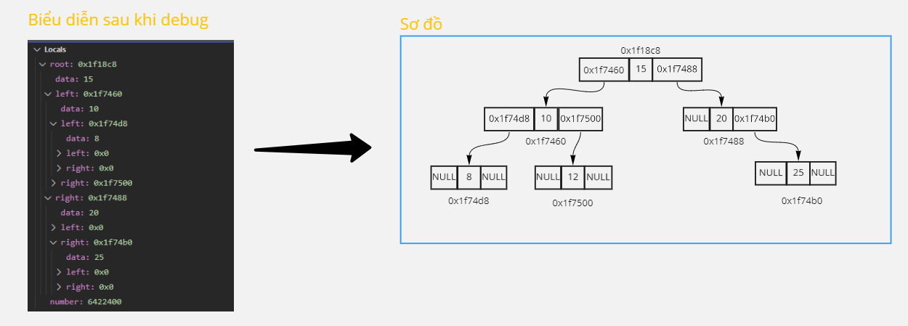
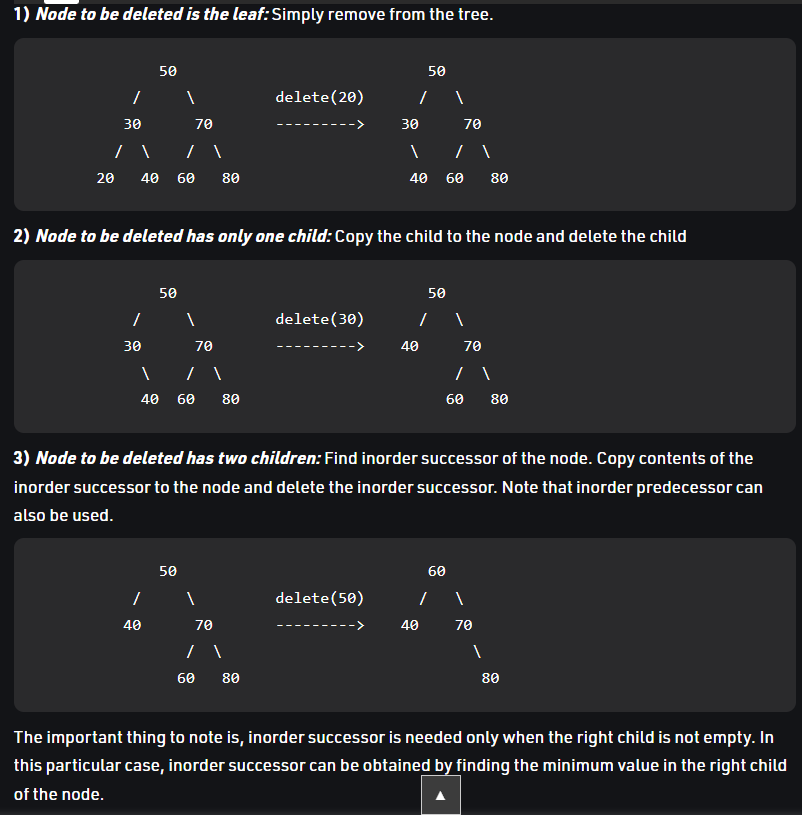

___**Contact :**___
- ___Github___:<https://github.com/Youknow2509>
- ___Gmail___: <lytranvinh.work@gmail.com>

# Binary Search Tree - Cây nhị phân

## *Giải thích cách biểu  diễn của cây nhị phân:*
- Là một cấu trúc dữ liệu dựa trên tính chất của nút.

- Nhánh bên **phải** của nút có giá trị **lớn hơn** giá trị nút.
- Nhánh bên **trái** của nút có giá trị **nhỏ hơn** giá trị của nút.
- Nhưng các giá trị có rằng buộc chứ k tự do, xem hình -> giải thích.

**Số 2 ở node sai , ở node này giá trị phải ````3 < giá_trị_node < 6 ````=> 4 True.**

## Với cây tìm kiến nhị phân chúng ta có những tác vụ cơ bản sau:
- Search: Tìm kiếm.
- Insert: Thêm 1 node.
- Remove: Xóa 1 node.
- Traversal: Duyệt cây với 3 loại cơ bản: pre-oder traversal, In-order traversal, post-order traversal.
  

