___**Contact :**___
- ___Github___:<https://github.com/Youknow2509>
- ___Gmail___: <lytranvinh.work@gmail.com>

# Application Binary Search Tree - Search Element In Array

Given a sorted array of size N and an integer K, find the position at which K is present in the array using binary search.

**Means:** Cho một mảng có kích thước N và một số nguyên K, bạn hãy ứng dụng BST để tìm vị trí của K trong mảng. 

**Chú ý** để tìm đc theo BST thì mảng phải có qui luật.

````
Input:
N = 5
arr[] = {1 2 3 4 5} 
K = 4
Output: 3
Explanation: 4 appears at index 3.
````

````
Input:
N = 5
arr[] = {11 22 33 44 55} 
K = 445
Output: -1
Explanation: 445 is not present.
````

# Code act:
**In the iterative approach, here is how the algorithm works:**
- At each step, consider the array between low and high indices.
- Calculate the mid index.
- If the element at the mid index is equal to the target value, we return mid.
- If the element at mid is greater than the target:
    - Change the index high to mid - 1.
    - The value of low remains the same.
- If the element at mid is less than the target:
    - Change low to mid + 1.
    - The value of high remains the same.
- When the value of low is greater than the value of high, this indicates that the target doesn’t exist. Hence, -1 is returned.

**Means:**
**Trong phương pháp lập thuật toán hoạt động như sau :**
- Tạo ra 3 giá trị ở mỗi bước để xét các giá trị cao, thấp và ở giữa.
- Giá trị ở giữa(mid) =  ( thấp(low) + cao(hight) ) /2 
    - Nếu phần tử tại giá trị ở giữa:
    - Bằng thì trả về giá trị mid
    - Lớn hơn giá trị K thì low = mid + 1
    - Nhỏ hơn giá trị K thì high = mid - 1
    - Bằng  low hoặc hight thì trả về giá trị arr[low]
...........

*Ưu điểm không phải duyệt qua tất cả phần tử của mảng*

### **Ex:** case have result

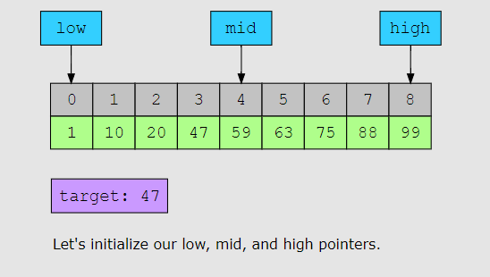
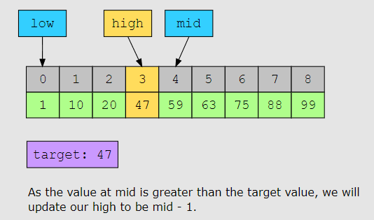
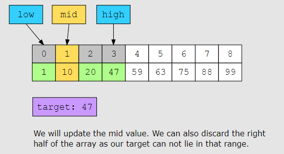
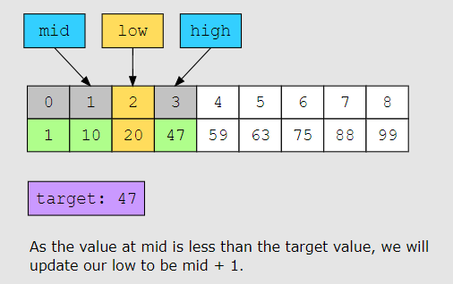

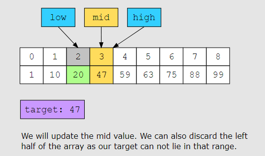


### **Ex:**  case no result 
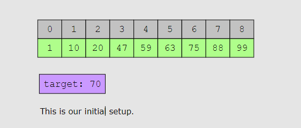
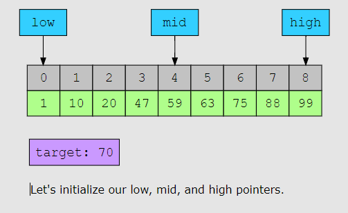
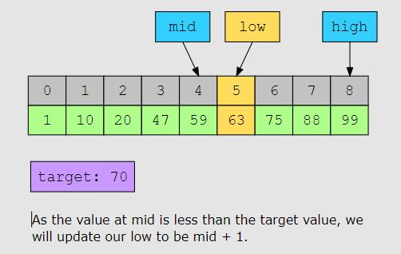
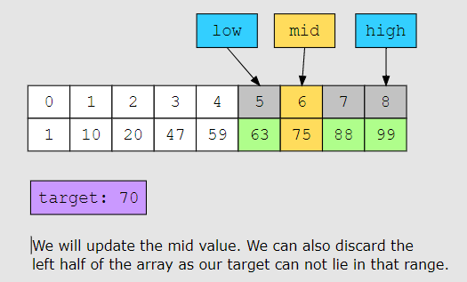
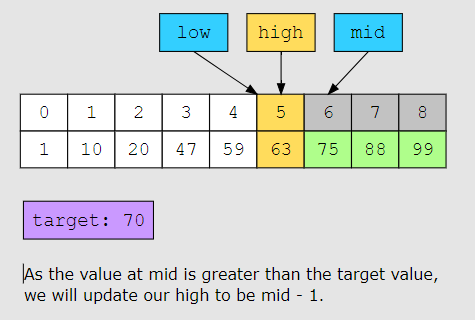
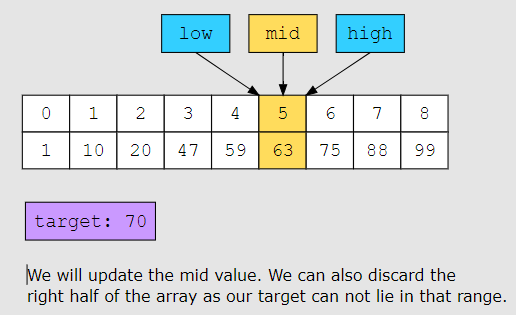
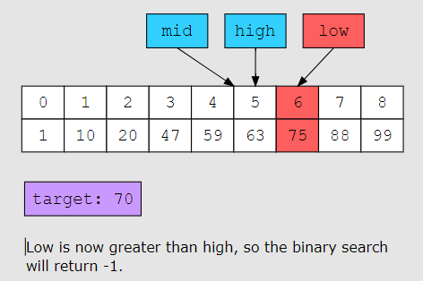