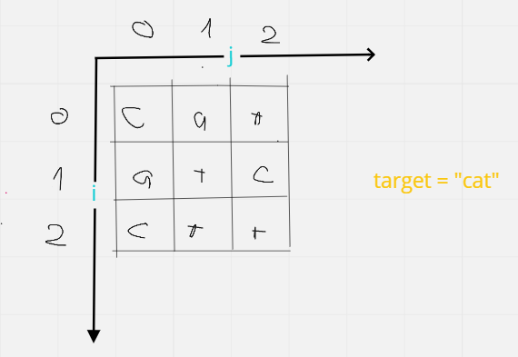

___**Contact :**___
- ___Github___:<https://github.com/Youknow2509>
- ___Gmail___: <lytranvinh.work@gmail.com>

# Count occurrences of a given word in a 2-d array - Đếm số lần xuất hiện của một từ nhất định trong mảng hai chiều:

*Dynamic Programming **Paytm** + **Google***

## Giả xử ứng dụng luôn vào trường hợp sau cho dễ giả thích:

  **Nhìn code và hình -> understand**