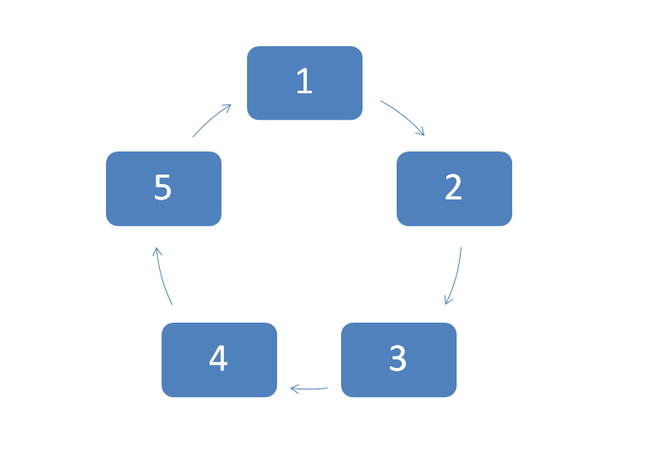
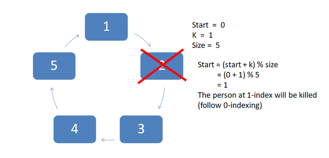
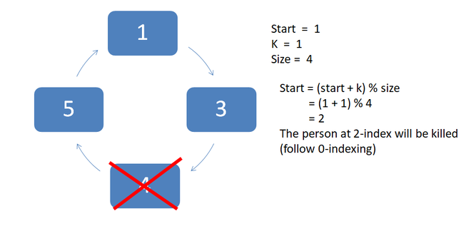
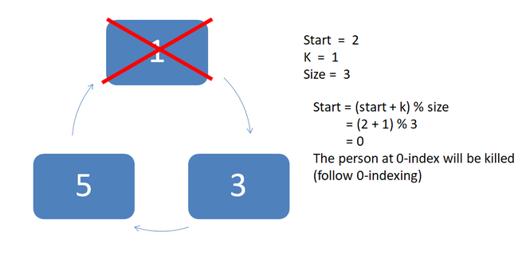
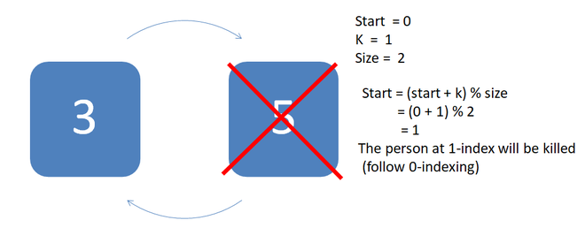
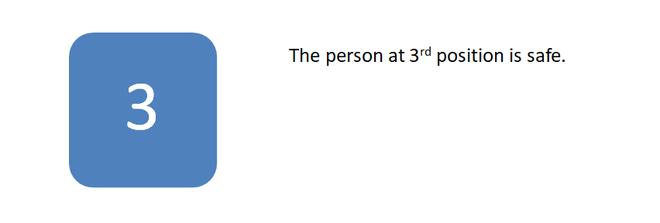

___**Contact :**___
- ___Github___:<https://github.com/Youknow2509>
- ___Gmail___: <lytranvinh.work@gmail.com>

# Find The Safe Position

*There are n people standing in a circle (numbered clockwise 1 to n) waiting to be executed. The counting begins at point 1 in the circle and proceeds around the circle in a fixed direction (clockwise). In each step, a certain number of people are skipped and the next person is executed. The elimination proceeds around the circle (which is becoming smaller and smaller as the executed people are removed), until only the last person remains, who is given freedom.
Given the total number of persons n and a number k which indicates that k-1 persons are skipped and k^th person is killed in circle. The task is to choose the place in the initial circle so that you are the last one remaining and so survive.*

**Vietnamese means:**
Cho n người xếp thành vòng tròn đánh số thứ tự từ 1 đến n theo chiều kim đồng hồ để chờ xử tử. 
Đầu vào gồm tổng số người n và số k. Biết người thứ k sẽ bị xử tử và k -1 người bị bỏ qua. Hãy tìm người cuối cùng sống xót.

````
Input: N = 5,  k = 2.
Output: 3.
````
**Explain:**
Add all values from 1 to N in the list. We will call the recursive function with start = 0 and k = 1 (0-indexing).

Now the element at 1-index (person number 2) will be killed. And it is removed from the list. The new counting will begin from 1-index, the person at 1-index killed so now person at 2-index (person number 3) comes to 1-index and counting starts from here now.

Now we have 4 people, counting starting from 1-index (person number 3) and the person at kth (2-index ) position will be killed. 

The person at 2-index (person number 4) was killed so now we have 3 people left and the person (person number 5) at 3-index shifted to 2-index. And counting starts from here.

The person at the 0-index was killed and we have now two-person left in the circle. And the person at 1-index shifted to 0-index i.e. person number 3.

Final counting done and the person at 1-index killed and the only person who is left is at position 3.



