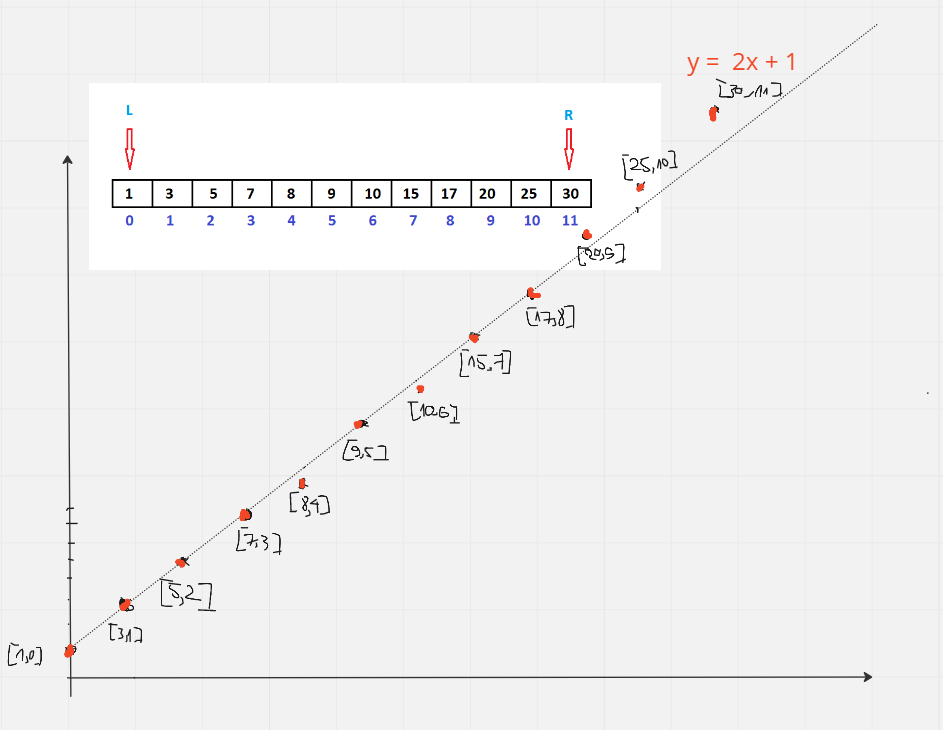
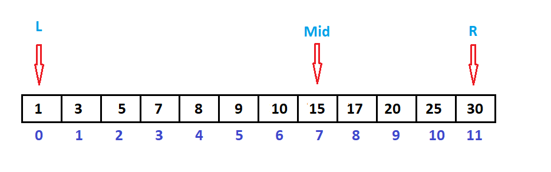
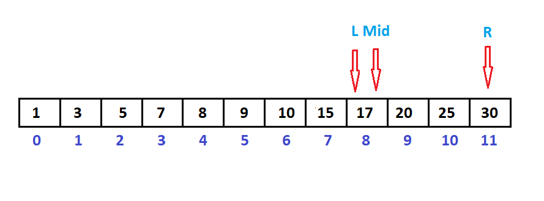
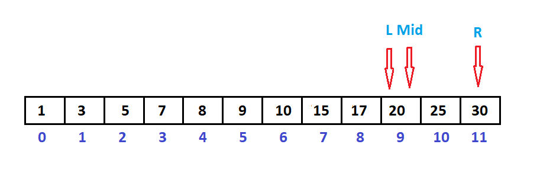

___**Contact :**___
- ___Github___:<https://github.com/Youknow2509>
- ___Gmail___: <lytranvinh.work@gmail.com>

# Interpolation Search - Tìm kiếm nội suy

- Cho một mảng đã được sắp xếp theo một thứ tự nhất định.
- Khi viết hàm để tìm kiếm một giá trị x trong mảng, sử dụng **Linear Search** độ phức tạp là **O(n)**, **Jump Search** là **O(căn n)** và **Binary Search** là **O(log n)**. 
- Thuật toán **Interpolation Search** khi thực hiện chương trình trên chỉ mất độ phức tạp là **O(log (log n))**.
- Thuật toán này hoạt động theo cách chúng ta tìm kiếm một từ trong từ điển. Thuật toán tìm kiếm nội suy cải thiện thuật toán tìm kiếm nhị phân. Công thức tìm giá trị:
  
```
                    K = (data - low)/(high - low)
```

## Công thức cho pos  được rút ra như sau:

```python
Giả sử rằng các phần tử của mảng được phân phối tuyến tính.

Phương trình tổng quát của đường thẳng y = m*x + c.

Trong đó y là giá trị trong mảng, i là chỉ mục.
Ta có:
arr[hi] = m*hi + c ---- (1)
arr[lo] = m*lo + c ---- (2)
x = m*pos + c ---- (3)

m = (arr[hi] - arr[lo]) / (hi -lo)

Từ (2) và (3):
x - arr[lo] = m*{pos-lo)
lo + (x - arr[lo])/m =pos
=> pos = lo + (x - arr[lo]) *(hi - lo)/(arr[hi] - arr[lo])
```

### Ví dụ: Tìm ví trí của x = 20 trong dãy a = [1, 3, 5, 7, 8, 9, 10, 15, 17, 20, 25, 30]







