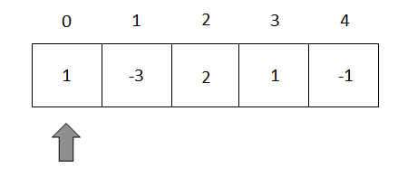

___**Contact**___
- ___Github___:<https://github.com/Youknow2509>
- ___Gmail___: <lytranvinh.work@gmail.com>
  

# ___**Thuật toán Kadane**___
*- Tính mảng con có tổng max.*
## *Cách hoạt động:*
- Dùng một vòng lập duyệt qua tất cả các thành phần của mảng. 

<p align="center">
  <a href="https://github.com/Youknow2509"></a>
</p>

- Giả sử khi chưa duyệt phần tử nào thì gán ```MAX = arr[0]```. 
- Tính tổng phần tử ```arr[0] + arr[1] = A```.
- Nếu ```A > arr[1]``` thì ```max = A```. Ta tiếp tục lấy ```A + arr[3]``` ....... Tiếp tục vòng lập và so sánh.

- Nếu ```A < arr[1]``` thì  tiếp tục vòng lập tính tổng  ```arr[2] + arr[3]``` ...... Tiếp tục vòng lập và so sánh.

[Kadane_Video](video/arr.mp4)

<p align="center">
  <a href="https://github.com/Youknow2509"><video controls autoplay loop src="https://cdn.discordapp.com/attachments/1017074667007254630/1017074735793840190/arr.mp4"></a>
</p>

<!-- <video controls autoplay loop>
    <source src="https://cdn.discordapp.com/attachments/1017074667007254630/1017074735793840190/arr.mp4">
</video> -->


