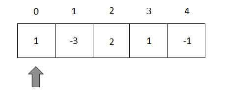

# **Thuật toán Kadane**

## *Cách hoạt động:*
- Dùng một vòng lập duyệt qua tất cả các thành phần của mảng. 

  

- Giả sử khi chưa duyệt phần tử nào thì gán **MAX = arr[0]**. 
- Tính tổng phần tử **arr[0] + arr[1] = A**.
- Nếu **A > arr[1]** thì **max = A**. Ta tiếp tục lấy **A + arr[3]** ....... Tiếp tục vòng lập và so sánh.

- Nếu **A < arr[1]** thì  tiếp tục vòng lập tính tổng  **arr[2] + arr[3]** ...... Tiếp tục vòng lập và so sánh.

[Video ví dụ...](arr.mp4)