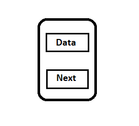
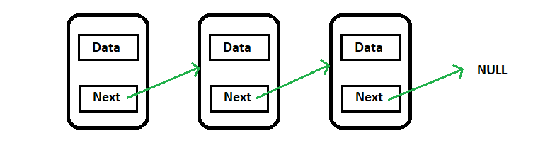

___**Contact :**___
- ___Github___:<https://github.com/Youknow2509>
- ___Gmail___: <lytranvinh.work@gmail.com>

# Link list

 - Link list là *cấu trúc dữ liệu động* sử dụng con trỏ để cài đặt. Danh sách liên kết đơn là một tập hợp các Node được phân bố động sao cho mỗi Node được phân bố chứa một giá trị **(Data)** và một con trỏ **(Next)**. Con trỏ sẽ trỏ đến phần tử kế tiếp của danh sách sẽ   trỏ  đến phần tử kế tiếp của danh sách liên kết đó. Nếu con trỏ mà trỏ tới NULL, nghĩa là đó là phần tử cuối cùng của **linked list**.
 - Với các ngôn ngữ khác như Java, C#, Python thì không tồn tại khái niệm con trỏ nên các bạn có thể dùng thư viện có sẵn.
 - Hình ảnh mình họa một node:

- Hình ảnh mình họa một **listLinker**:

- Khai báo **node**: 
```c++
struct node{
    int data;
    Node* next;
};
```
- Tạo mới một **node**:
```c++
node *createNode(int x){
    node *temp = new node; // tạo mới một node
    temp->next = NULL; // node này chưa trỏ đến phần tử khác nên "next" nhận giá trị NULL
    temp->data = x;  // gán giá trị cho node
    return temp;
}
```
- Thêm một phần tử vào cuối **listLinker** *khi biết con trỏ đang trỏ vào phần tử cuối*:
```c++
node *addElement(node*p, int x){
	node *temp = createNode(x); // Tạo 1 node mới có giá trị là x.
	p->next = temp; // Thêm node đó và cuối danh sách.
	return temp; // trả về node temp, vì temp giờ đã là node cuối của list.
}
```
- So sánh mảng và danh sách liên kết:

| Nội dung	  | Mảng         | Danh sách liên kết|
| ----------- | -------------| ----------------- |
|  Kích thước | Kích thước cố định. Cần chỉ rõ kích thước trong khi khai báo  | Kích thước thay đổi trong quá trình thêm/ xóa phần tử. Kích thước tối đa phụ thuộc vào bộ nhớ |
| Cấp phát bộ nhớ | Tĩnh: Bộ nhớ được cấp phát trong quá trình biên dịch | Động: Bộ nhớ được cấp phát trong quá trình chạy |
| Thứ tự & sắp xếp | Được lưu trữ trên một dãy ô nhớ liên tục | Được lưu trữ trên các ô nhớ ngẫu nhiên |
| Truy cập | Truy cập tới phần tử ngẫu nhiên trực tiếp bằng cách sử dụng chỉ số mảng: O(1) | Truy cập tới phần tử ngẫu nhiên cần phải duyệt từ đầu/cuối đến phần tử đó: O(n) |
| Tìm kiếm | Tìm kiếm tuyến tính hoặc tìm kiếm nhị phân | Chỉ có thể tìm kiếm tuyến tính |
