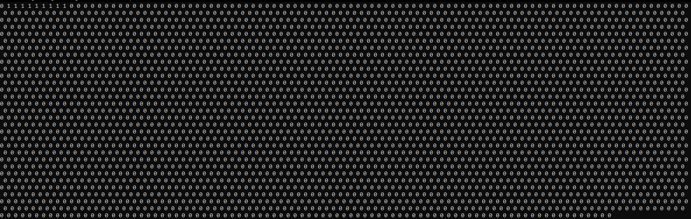

___**Contact**___
- ___Github___:<https://github.com/Youknow2509>
- ___Gmail___: <lytranvinh.work@gmail.com>

# Active: 
- Tạo một mảng mới (B) toàn  số 0 với chiều dài rất lớn.
- Giá trị của mảng ban đầu (A) là bao nhiêu thì số thứ n của mảng (B) đổi 0 thành 1.
  
=> *Lợi ích sắp xếp được các số liên tiếp theo một chiều xác định, các số cùng giá trị được gộp lại.*
- Đếm có bao nhiêu số 1 liên tiếp, số số 1 liên tiếp **lớn nhất** chính là đáp án.

````
I do it 10/09/22
````