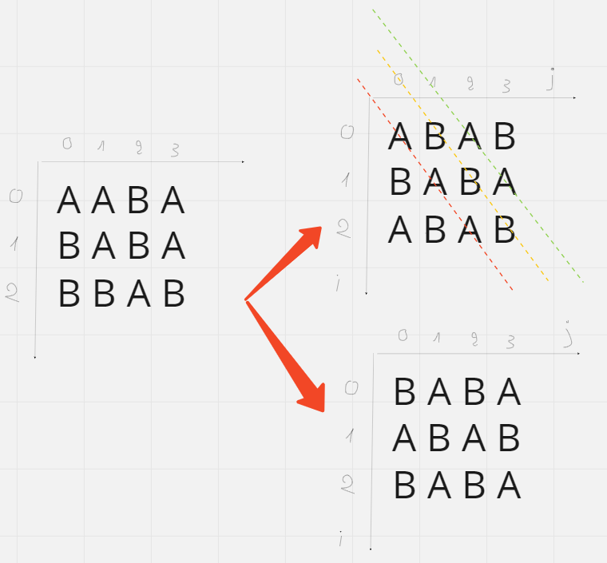

___**Contact :**___
- ___Github___:<https://github.com/Youknow2509>
- ___Gmail___: <lytranvinh.work@gmail.com>

**Problem of the day: 12/09/22**
# Minimum Exchange

- Given a matrix of size n*m. Every cell of matrix contains either 'A' or 'B'. Exchange is defined as swaping the characters between two cells. Your task is to find the minimum number of exchange needed to rearrange the given matrix such that no adjacent cell contains the same characters.
- Two cells are adjacent if they share one of their common sides (left,right,front or back if exists).

**Ex:**
````
Input: matrix = {{A,A,B,A},{B,A,B,A},{B,B,A,B}}
Output: 4
Explanation: Minimum number of students whose 
sets got changed are 4 (indexes: ((0,1),(0,2),
(0,3),(2,0))). The final alloted sets are:
A B A B
B A B A
A B A B
````

````
Input: matrix = {{A,B},{B,A}}
Output: 0
Explanation: No two adjacent cell contains same
character.
````
# Xét vào Ex 1: 
- Để thỏa mãn yêu cầu đề không có kí tự nào giống nhau cạnh nhau (bên trái, bên phải, bên trên, bên dưới) thì sẽ có hai trường hợp xảy ra như hình.


- Khi **các** trường hợp đúng xảy ra thì các đường gạch chéo có **kí tự giống nhau** mà các kí tự giống nhau này có điều đăc biệt là khi tọa độ (i + j) sẽ cùng chẵn hoặc cùng lẻ
- 
## **=> Xử lí thuật toán:**
Xét ````( i + j )```` **chẵn**:
-> Ép trường hợp ````( i + j )```` **chẵn** là kí tự ````'A'```` => nếu ````maxtrix[i][j]```` khác ````'A'```` => ````result_1 = result_1 + 1````
=> ````( i + j )```` **lẻ** sẽ là ````'B'```` => nếu ````maxtrix[i][j]```` khác ````'B'```` => ````result_1 = result_1 + 1````
===> Trường hợp 2 lồng vào đảo ngược ````( i + j )```` **chẵn** là kí tự ````'B'```` và ````( i + j )```` **lẻ** là kí tự ````'A'```` -> ````result_2````.
Đáp án bài toán sẽ là ````min(result_1, result_2)````
