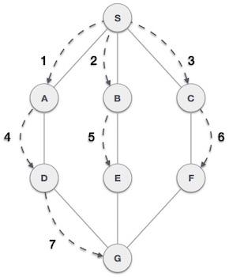

# Cấu trúc dữ liệu đồ thị - Graph

## 1. Cấu trúc dữ liệu đồ thị:

- Đồ thị là một dạng biểu diễn hình ảnh của một tập các đối tượng, trong đó các cặp đối tượng được kết nối với nhau bởi `link`.
-  Các đối tượng được nối liên kết được biểu diễn bởi các điểm được gọi là các đỉnh (`vertices`) và các link mà kết nối các đỉnh với nhau được gọi là các cạnh (`edges`).
- Nói chung đồ thị là tập hợp các tập hợp `(V, E)`, trong đó `V` là tập các đỉnh và `E` là tập hợp các cạnh mà kết nối các cặp điểm. Bạn theo dõi đồ thị sau: 
  
    

- Trong đồ thị trên: 
    - `V = {a, b, c, d, e}`.
    - `E = {ab, ac, bd, cd, de}`.

## 2. Các khái niệm cơ bản: 
### 2.1. Đỉnh - Vertex:

- Mỗi nút được biểu diễn như là một đỉnh. Trong hình trên các hình tròn biểu diễn các đỉnh. Do đó các điểm từ A đến G là các đỉnh.
- Chúng ta có thể biểu diễn các đỉnh này bỏi sử dụng một mảng, trong đó đỉnh `A` có thể nhận được bởi chỉ mục `0`, điểm `B` là chỉ mục `1`.

### 2.2. Cạnh - Edge:

- Cạnh biểu diễn một đường nối hai đỉnh. Trong hình dưới , các đường nối A và B, B và C, ... là các cạnh.
- Chúng ta có thể sử dụng mảng 2 chiều để lưu các cạnh này.
- Trong hình trên, `AB` có thể được biểu diễn như là `1` tại hàng `0`; `BC` là `1` tại hàng `1`, ...`

### 2.3. Kề nhau:

- Hai đỉnh kề nhau là hai đỉnh được kết nối với nhau qua một cạnh.

### 2.4. Đường: 

Đường biểu diễn một dãy các cạnh giữa hai đỉnh. Trong hình trên, `ABCD` biểu diễn một đường từ `A` đến `D`.`

## 3. Giải thuật tìm kiếm chiều sâu - Depth First Search:
- Giải thuật tìm kiếm chiều sâu còn được gọi là giải thuật tìm kiếm ưu tiên chiều sâu, là giải thuật duyệt hoặc tìm kiếm trên một cây hoặc một đồ thị và sử dụng `stack` (ngăn xếp) để ghi nhớ đỉnh liên kết để bắt đầu việc tìm kiếm khi không gặp đươc đỉnh liền kề trong bất kỳ vòng lập nào.
- Giải thuật tiếp tục cho tới khi gặp được đỉnh cần tìm hoặc tới một nút không có con. Khi đó giải thuật quay lui về đỉnh vừa mới tìm kiếm ở bước trước. 

    

### 3.1. Quy tắc: 
- Duyệt tới đỉnh liền kề mà chưa được duyệt. Đánh dấu đỉnh mà đã được duyệt. Hiển thị đỉnh đó và đẩy vào trong một ngăn xếp (`stack`).
- Nếu không tìm thấy đỉnh liền kề, thì lấy một đỉnh từ trong ngăn xếp (thao tác pop up). (Giải thuật sẽ lấy tất cả các đỉnh từ trong ngăn xếp mà không có các đỉnh liền kề nào).
- Lập lại các qui tắc `1` và qui tắc `2`cho tới khi ngăn xếp là trống. 

### 3.2. Các bước thực hiện: 
- Khởi tạo ngăn xếp (`stack`):`

        

- Đầu tiên ta đánh dấu đỉnh `S` là đã duyệt và đưa đỉnh này vào trong ngăn xếp. Tiếp theo chúng ta tìm kiếm bất kỳ đỉnh kề nào mà chưa được duyệt từ `S`. Chúng ta có `3` đỉnh và chúng ta có thể lấy bất kỳ đỉnh nào trong số chúng. Ví dụ, chúng ta lấy đỉnh `A` theo thứ tự chữ cái.

    

- Tiếp theo ta đánh dấu đỉnh là `A` là đã duyệt vào đặt trong ngăn xếp. Tìm kiếm bất kỳ điểm liền kề nào với đỉnh `A`. Cả `S` và `D` đều là hai đỉnh liền kề `A` nhưng chúng ta chỉ quan tâm về đỉnh chưa được duyệt. 

       

- Duyệt đỉnh `D`, chúng ta đánh dấu đỉnh này là đã duyệt và đưa vào trong ngăn xếp. Ở đây, chúng ta có `B` và `C` là hai đỉnh liền kề với `D` và cả hai đỉnh đều chưa được duyệt. Chúng ta sẽ chọn theo bảng chữ cái một lần nữa.

    

- Chúng ta chọn đỉnh `B`, đánh dấu là đã duyệt và đưa vào trong ngăn xếp. Ở đây đỉnh `B` không có bất kì đỉnh nào mà chưa được duyệt. Vì thế chúng ta lấy `B` ra khỏi ngăn xếp.

    

- Chúng ta kiểm tra phần tử trên cùng của ngăn xếp để trở về nút đã duyệt trước đó và kiểm tra xem đỉnh này có đỉnh nào kề mà chưa được duyệt hay không. Ở đây, chúng ta tìm thấy đỉnh `D` nằm ở trên cùng của ngăn xếp.

    

- Ở đây chúng ta chỉ có một đỉnh kề với `D` mà chưa được duyệt, đó là `C`. Chúng ta duyệt đỉnh `C`, đánh dấu là đã duyệt và đưa vào trong ngăn xếp.

    

- Vì đỉnh `C` không có bất kỳ đỉnh nào liền kề mà chưa được duyệt, chúng ta tiếp tục lấy các đỉnh từ trong ngăn xếp để tìm xem có còn bất kỳ đỉnh nào liền kề mà chưa được duyệt hay không. Trong ví dụ này là không có, và chúng ta vẫn tiếp tục cho tới khi ngăn xếp là trống.

## 4. Giải thuật tìm kiếm theo chiều rộng - Breadth First Search:
- Giải thuật tìm kiếm theo chiều rộng duyệt qua một đồ thị theo chiều rộng và sử dụng hàng đợi (`queue`) để ghi nhớ đỉnh liền kề để bắt đầu việc tìm kiếm khi không gặp được đỉnh liền kề trong bất kì vòng lập nào. 
  
    

### 4.1. Quy tắc:
- Duyệt tiếp tới đỉnh liền kề mà chưa được duyệt. Đánh dấu đỉnh mà đã được duyệt. Hiển thị đỉnh đó và đẩy vào trong một hàng đợi (`queue`).
- Nếu không tìm thấy đỉnh liền kề, thì xóa đỉnh đầu tiên trong hàng đợi.
- Lặp lại Qui tắc 1 và 2 cho tới khi hàng đợi là trống.

### 4.2. Các bước thực hiện:
- Đầu tiên chúng ta khởi tạo hàng đợi (`queue`) như hình dưới.

    

- Chúng ta duyệt từ đỉnh `S` (đỉnh bắt đầu) và đánh dấu đỉnh này là đã duyệt.

    

- Sau đó chúng ta tìm đỉnh liền kề với đỉnh `S` mà chưa được duyệt. Trong ví dụ này chúng ta có `3` đỉnh là `A,B,C` , và theo thứ tự chữ cái chúng ta chọn đỉnh `A` đánh dấu là đã duyệt và đưa đỉnh `A` vào hàng đợi.

    

- Chúng ta tiếp tục duyệt đỉnh liền kề với đỉnh `S` là đỉnh `B`. Đánh dấu là đã duyệt và đưa đỉnh `B` vào hàng đợi.

    

- Tiếp tục duyệt đỉnh `C`. Đánh dấu đỉnh `C` là đã duyệt và đưa đỉnh `C` vào hàng đợi.

    

- Bây giờ đỉnh `S` không còn đỉnh nào liền kề mà chưa được duyệt. Bây giờ chúng ta rút `A` từ hàng đợi.

    

- Từ đỉnh `A` chúng ta có đỉnh liền kề là `D` và là đỉnh chưa được duyệt. Đánh dấu đỉnh `D` là đã duyệt và đưa vào hàng đợi.

    

- Chúng ta vẫn tiếp tục rút các đỉnh từ hàng đợi theo thứ tự để tìm tất cả các đỉnh mà chưa được duyệt. Khi hàng đợi là trống thì đó là lúc kết thúc giải thuật.

## 5. Sự khác biệt giữa BFS và DFS:

- `DFS` giải quyết bài toàn theo cách đào `sâu` nhất có thể từ một đỉnh còn `BFS` thì duyệt tất cả các đỉnh liền kề với đỉnh đang duyệt, ở đây chính là độ `rộng` và độ `sâu` của thuật toán.