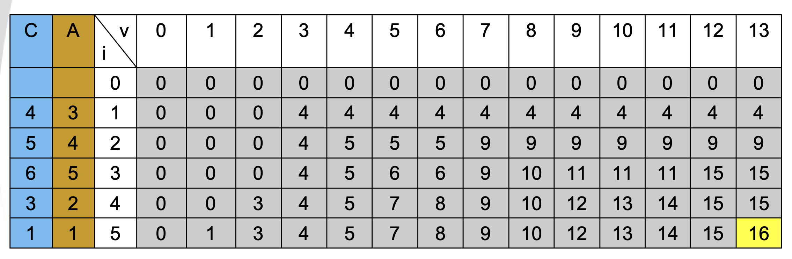
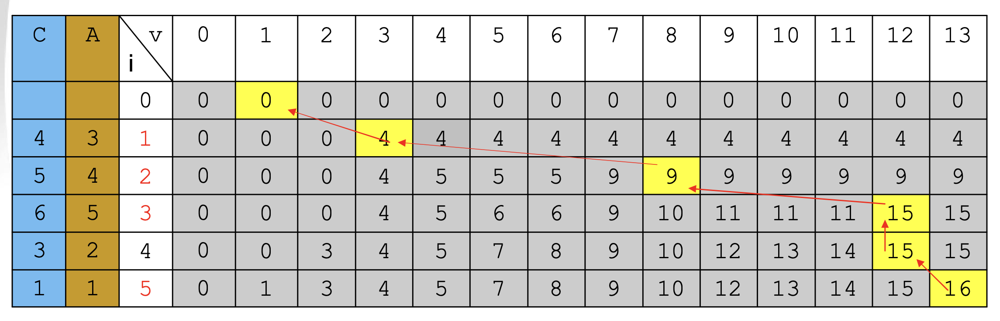

```markdown
Cho n gói hàng. Gói hàng thứ i có khối lượng là A[i] và giá trị C[i]. 
Cần chọn những gói hàng nào để bỏ vào một ba lô sao 

"Tổng giá trị của các gói hàng đã chọn là lớn nhất 
nhưng tổng khối lượng của chúng không vượt quá khối lượng M cho trước". 

Mỗi gói chỉ chọn 1 hoặc không chọn. 

In ra tổng giá trị lớn nhất
```

### Nhận xét: 

- Kết quả bài toán là **tổng giá trị lớn nhất** của các món hàng được chọn trong `n` món **sao** cho **tổng khối lượng không lớn hơn M cho trước**, ký hiệu là `F(n)`.
- Tham số thể hiện kích thước bài toán là số món hàng `n`.
- Giá trị của `F(n)` có thể được tính từ giá trị của `F(n-1)` cộng thêm hoặc không cộng thêm giá trị của món hàng thứ `n` nhưng tổng khối lượng không lớn hơn `M`.
- Nếu chọn thêm món hàng thứ `n` thì tổng khối lượng được chọn trong `(n-1)` món hàng không lớn hơn `(M-A[n])`.
- Suy ra bài toán có 2 tham số: số món hàng và khối lượng giới hạn.

### Lập công thức đệ qui:

- Gọi `F(i, v)` là tổng giá trị lớn nhất của các gói hàng được chọn trong `i` gói hàng sao cho tổng khối lượng không lớn hơn `v`.
  
- Trường hợp `A[i] > v`: `(1)`
  -> cho giá trị sau bằng giá trị trước.
    `F(i, v) = F(i -1, v)`

- Trường hợp `A[i] <= v`:
    - Nếu gói hàng thứ `i` không được chọn thì làm như `(1)`.
    - Nếu gói hàng thứ `i` được chọn thì:
        `F(i, v) = F(i -1, v – A[i]) + C[i]`
        -> `F(i, v) = Max{F(i -1, v); F(i -1, v – A[i]) + C[i])}`

- Bài toán **nhỏ nhất** ứng với `i = 0` ta có: `F(0, v) = 0`.

### Ví dụ:

- Cho `n = 5`, `m = 13`.

| i | 1 | 2 | 3 | 4 | 5 |
| - | - | - | - | - | - |
| A [i] | 3 | 4 | 5 | 2 | 1 |
| C [i] | 4 | 5 | 6 | 3 | 1 |

- Ta có bảng phương án:

    

**=> Đáp án:** 16
- Truy vết tìm lại các gói hàng đã chọn
    


  
