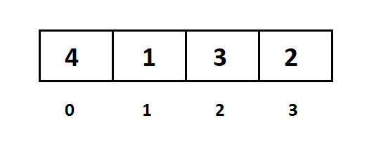
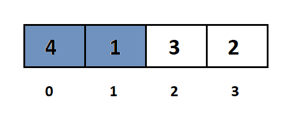
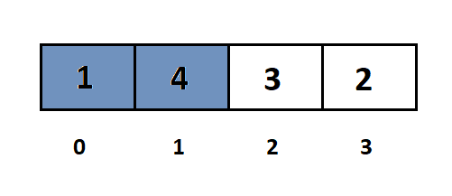
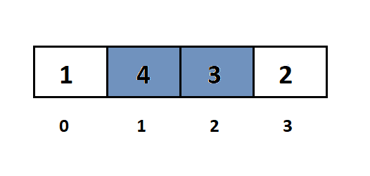
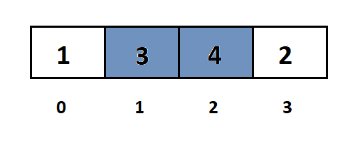
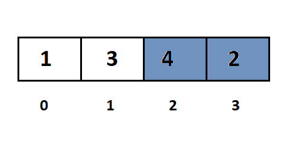
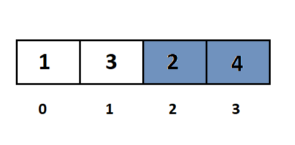
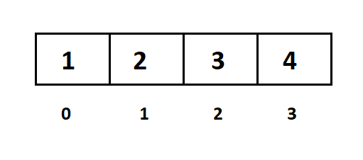

___**Contact :**___
- ___Github___:<https://github.com/Youknow2509>
- ___Gmail___: <lytranvinh.work@gmail.com>

# Bubble Sort

Sắp xếp nổi bọt là một giải thuật sắp xếp đơn giản. Giải thuật sắp xếp này được tiến hành dựa trên việc so sánh cặp phần tử liền kề nhau và tráo đổi thứ tự nếu chúng không theo thứ tự.

Giải thuật này không thích hợp sử dụng với các tập dữ liệu lớn khi mà độ phức tạp trường hợp xấu nhất và trường hợp trung bình là Ο(n2) với n là số phần tử.

Giải thuật sắp xếp nổi bọt là giải thuật chậm nhất trong số các giải thuật sắp xếp cơ bản. Giải thuật này còn chậm hơn giải thuật đổi chỗ trực tiếp mặc dù số lần so sánh bằng nhau, nhưng do đổi chỗ hai phần tử kề nhau nên số lần đổi chỗ nhiều hơn.

# Cách Bubble Sort hoạt động:

Thuật toán cho cách sắp xếp này sẽ lần lượt đưa các số lớn nhất về ví trí cuối dãy bằng cách so sánh các cặp số kề nhau.

Ví dụ sắp xếp dãy ```a = [4, 1, 3, 2]```  thành dãy tăng dần.

 

Đầu tiên ta so sánh 2 phần tử kề nhau là ```a[0]``` và ```a[1]```.



Nếu ```a[0]``` > ```a[1]``` thì ta tráo đổi vị trí của chúng.



Tiếp tục so sánh ```a[1]``` và ```a[2]```:



Nếu ```a[1] > a[2]```, thì ta tráo đổi vị trí giữa chúng.



Tiếp tục so sánh ```a[2]``` và ```a[3]```.



Nếu ```a[2]``` > ```a[3]```, thì ta tráo đổi vị trí giữa chúng:



Lúc này ta nhận thấy rằng phần tử lớn nhất đã được đưa đến vị trí cuối cùng của dãy a, kết thúc một bước sắp xếp.

Như vậy ta thấy rằng: mỗi bước sắp xếp ta sẽ lần lượt đưa được phần tử lớn nhất về cuối dãy.

Với bước sắp xếp tiếp theo ta chỉ cần xét các cặp phần tử ```a[0]``` và ```a[1]```,```a[1]``` và ```a[2]```, không xét cặp ```a[2]``` và ```a[3]``` nữa, vì ```a[3]``` đã ở đúng vị trí rồi.

Sau khi đổi cho ```a[1]``` và ```a[2]``` dãy sẽ thành:




