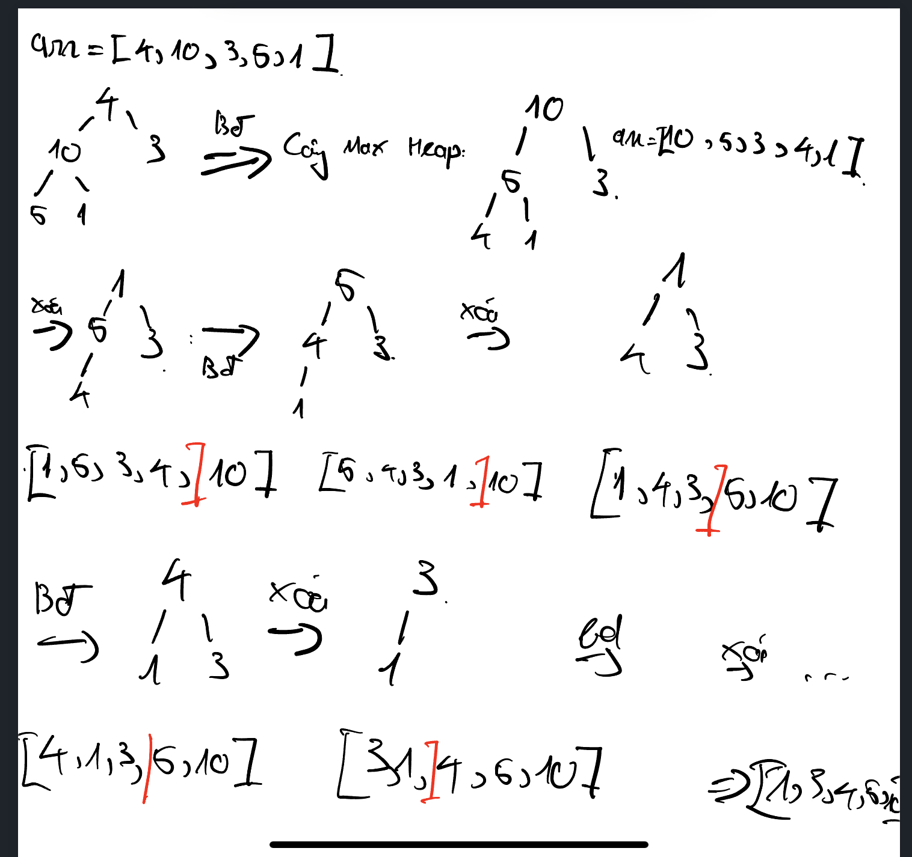

# Cấu trúc dữ liệu Heap Sort:

- So sánh: Gần giống thuật toán Merge Sort nhưng bộ nhớ được tối ưu hơn.

- Cách thức thực hiện:
    + Khởi tạo cây Max Heap, biến đổi các vị trí các phần tử trong mảng tương đương với các giá trị trên cây Max Heap.
    + Lấy phần tử lớn nhất trong cây Max Heap, phần tử đầu tiên. Đổi chỗ với phần tử cuối mảng, giảm kích thước cây Max Heap, khởi tạo lại cây Max Heap
    + Loop lại cho đến phần tử cuối cùng.
  

# Định nghĩa cây Max Heap:

- Mỗi nút gốc có giá trị lớn hơn các nút lá.
- Thứ tự các nút lá phải đầy mới đến nút kế tiếp, không được nhảy cách.

# Cách tạo cây Max Heap:

- Dùng đệ qui, chia để trị, sắp xếp từ phần tử nhỏ nhất xong sắp xếp dồn như Merge Sort nhưng ko cần thêm bộ nhớ. Với nút chỉ định `i`: nút bên **trái** có chỉ số trên mảng là `2i + 1` và nút bên **phải** `2i + 2`. Nút cha của nút `i` là `(i - 1)/2`.
- Từ đó hình dung chuyển đổi giá trị trên cây nhưng chỉ biến đổi nó trên mảng.
- Tại vì nút cha của nút thứ `i` là `(i - 1)/2`. Nên để tối ưu nhất chúng ta sẽ khởi tạo từ nút `(N - 1)/2`, `N` là số nút của mảng.