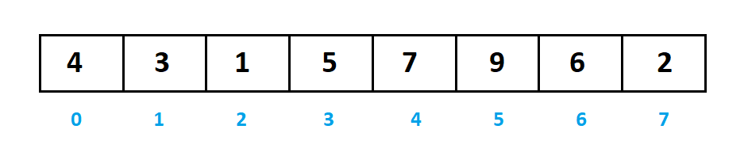
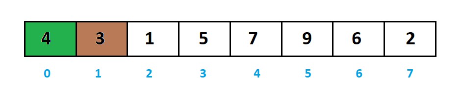
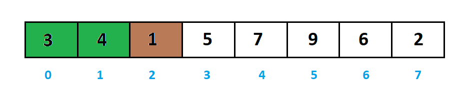
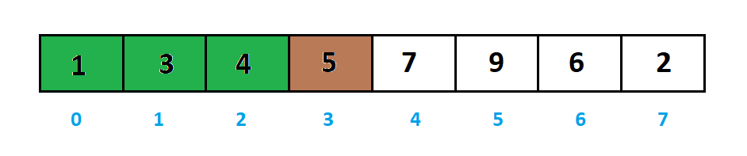
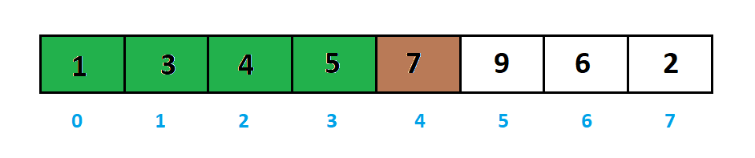
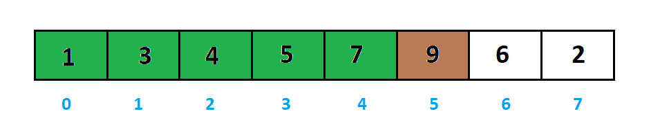
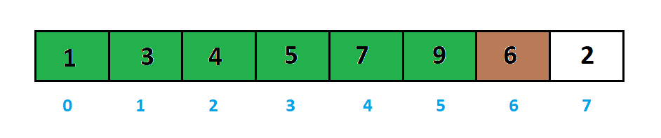
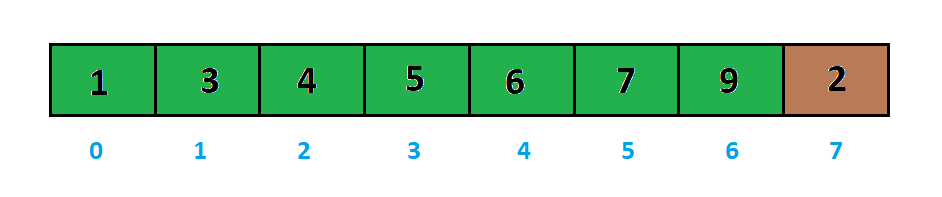
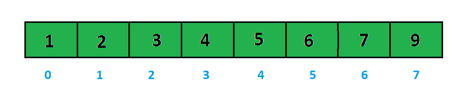

___**Contact :**___
- ___Github___:<https://github.com/Youknow2509>
- ___Gmail___: <lytranvinh.work@gmail.com>

# Insertion Sort - Sắp xếp chèn

**Sắp xếp chèn** là một giải thuật sắp xếp dựa trên so sánh **in-place**. Ở đây, một danh sách con luôn luôn được duy trì dưới dạng đã qua sắp xếp. Sắp xếp chèn là chèn thêm một phần tử vào danh sách con đã qua sắp xếp. Phần tử được chèn vào vị trí thích hợp sao cho vẫn đảm bảo rằng danh sách con đó vẫn sắp theo thứ tự.

Với cấu trúc dữ liệu mảng, chúng ta tưởng tượng là: mảng gồm hai phần: một danh sách con đã được sắp xếp và phần khác là các phần tử không có thứ tự. Giải thuật sắp xếp chèn sẽ thực hiện việc tìm kiếm liên tiếp qua mảng đó, và các phần tử không có thứ tự sẽ được di chuyển và được chèn vào vị trí thích hợp trong danh sách con (của cùng mảng đó).

Giải thuật này không thích hợp sử dụng với các tập dữ liệu lớn khi độ phức tạp trường hợp xấu nhất và trường hợp trung bình là Ο(n2) với n là số phần tử.

## Cách hoạt động của giải thuật sắp xếp chèn.

Ví dụ như bài toán sắp xếp dãy a thành dãy không giảm với:
```a = [4, 3, 1, 5, 7, 9, 6, 2]```



Để minh họa chúng ta sẽ dùng những phần tử màu xanh để chỉ những phần tử trong dãy con. phần tử màu nâu đề chỉ phần tử đang xét vào.

Ban đầu ta sẽ khởi tạo dãy con bằng ```a[0]```, đương nhiên với dãy con một phần tử thì nó đã được sắp xếp.

Ta bắt đầu xét từ phần tử có chỉ số ```1``` đến ```n-1```.



Sau khi chèn phần tử ```a[1]``` vào dãy con đã sắp xếp, dãy a sẽ thay đổi như sau. Ta tiếp tục xét phần tử ```a[2]```.



Sau khi chèn phần tử ```a[2]``` vào dãy con đã sắp xếp, dãy a sẽ thay đổi như sau. Ta tiếp tục xét phần tử ```a[3]```.



Sau khi chèn phần tử ```a[3]``` vào dãy con đã sắp xếp, dãy a sẽ thay đổi như sau. Ta tiếp tục xét phần tử ```a[4]```.



Sau khi chèn phần tử ```a[4]``` vào dãy con đã sắp xếp, dãy a sẽ thay đổi như sau. Ta tiếp tục xét phần tử ```a[5]```.



Sau khi chèn phần tử ```a[5]``` vào dãy con đã sắp xếp, dãy a sẽ thay đổi như sau. Ta tiếp tục xét phần tử ```a[6]```.



Sau khi chèn phần tử ```a[6]``` vào dãy con đã sắp xếp, dãy a sẽ thay đổi như sau. Ta tiếp tục xét phần tử ```a[7]```.



Chèn ```a[7]``` vào dãy a xong là ta đã hoàn thành quá trình sắp xếp.




