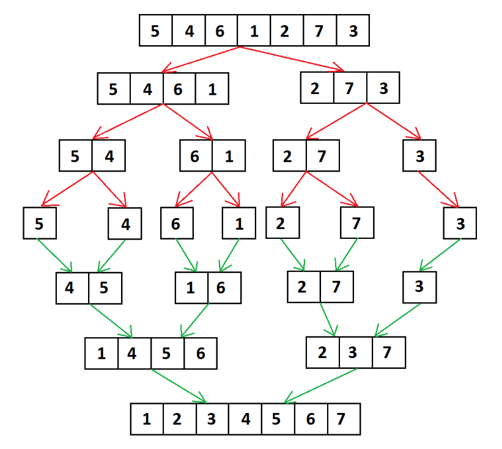

___**Contact :**___
- ___Github___:<https://github.com/Youknow2509>
- ___Gmail___: <lytranvinh.work@gmail.com>

# Merge Sort - Sắp xếp trộn

- **Sắp xếp trộn (Merge Sort)** là một giải thuật sắp xếp dựa trên giải thuật **Chia để trị (Divide and Conquer)**. Với độ phức tạp thời gian trường hợp xấu nhất là **Ο(n log n)** thì đây là một trong các giải thuật đáng được quan tâm nhất.
- Đầu tiên, giải thuật sắp xếp trộn chia mảng thành hai nửa và sau đó kết hợp chúng lại với nhau thành một mảng đã được sắp xếp.

# Ý tưởng thuật toán.

```c++
mergeSort(a[], l,  r)
if r > l
     1. Tìm chỉ số nằm giữa mảng để chia mảng thành 2 nửa:
             middle m = (l+r)/2
     2. Gọi đệ quy hàm mergeSort cho nửa đầu tiên:  
             mergeSort(a, l, m)
     3. Gọi đệ quy hàm mergeSort cho nửa thứ hai:
             mergeSort(a, m+1, r)
     4. Gộp 2 nửa mảng đã sắp xếp ở (2) và (3):
             merge(a, l, m, r)
```

## Hình ảnh ví dụ:



Hình ảnh trên hiển thị cho bạn toàn bộ sơ đồ tiến trình của thuật toán **merge sort** cho mảng `[5, 4, 6, 1, 2, 7, 3]`. Nếu nhìn kỹ hơn vào sơ đồ này, chúng ta có thể thấy mảng ban đầu được lặp lại hành động chia cho tới khi kích thước các mảng sau chia là 1. Khi kích thước các mảng con là 1, tiến trình gộp sẽ bắt đầu thực hiện gộp lại các mảng này cho tới khi hoàn thành và chỉ còn một mảng đã sắp xếp.