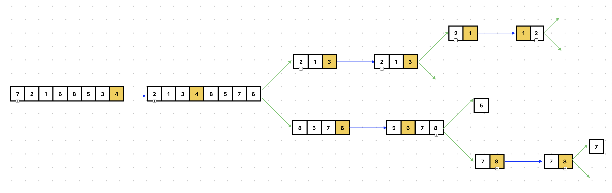

___**Contact :**___
- ___Github___:<https://github.com/Youknow2509>
- ___Gmail___: <lytranvinh.work@gmail.com>

# Quick Sort

- Cũng giống như Merge sort, Quick sort cũng xử dụng chia để trị để viết thuật toán. 

## Bảng so sánh các thuật toán sắp xếp
| ---- | ---- | ------- | ----- |------- | ------ | ------ | 
| Name | Best | Average | Worst | Memory | Stable | Method | 
|
**Xem video để hiểu chi tiết:** https://www.youtube.com/watch?v=COk73cpQbFQ

- Giải thuật sắp xếp nhanh (**Quick Sort**) là một giải thuật hiệu quả cao và dựa trên việc chia mảng dữa liệu thành các mảng nhỏ hơn. Giải thuật sắp xếp nhanh chia mảng thành hai phần bằng cách so sánh từng phần tử của mảng với một phần tử được chọn gọi là phần tử chốt (**Pivot**): một mảng bao gồm các phần tử nhỏ hơn hoặc bằng phần tử chốt và mảng còn lại bao gồm các phần tử lớn hơn hoặc bằng phần tử chốt.
- Tiến trình chia này diễn ra tiếp tục cho tới khi độ dài của các mảng con đều bằng `1`. Giải thuật sắp xếp nhanh tỏ ra khá hiệu quả với các tập dữ liệu lớn khi mà độ phức tạp trường hợp trung bình và trường hợp xấu nhất là **O(nlogn)** với `n` là số phần tử.
- Kỹ thuật chọn phần tử chốt trong giải thuật sắp xếp nhanh (Quick Sort)
Kỹ thuật chọn phần tử chốt ảnh hưởng khá nhiều đến khả năng rơi vào các vòng lặp vô hạn đối với các trường hợp đặc biệt. Tốt nhất là chọn phần tử chốt (pivot) nằm ở trung vị của danh sách. Khi đó, sau log2(n) lần chia chúng ta sẽ đạt tới kích thước các mảng con bằng 1.
- Dưới đây là các cách chọn phần tử chốt:

    - Chọn phần tử đứng đầu hoặc đứng cuối làm phần tử chốt.

    - Chọn phần tử đứng giữa danh sách làm phần tử chốt.

    - Chọn phần tử trung vị trong ba phần tử đứng đầu, đứng giữa và đứng cuối làm phần tử chốt.

    - Chọn phần tử ngẫu nhiên làm phần tử chốt. Tuy nhiên cách này rất dễ dẫn đến khả năng rơi vào các trường hợp đặc biệt.
- Cách hoạt động của **Quick Sort**:
     

