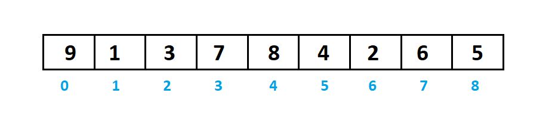
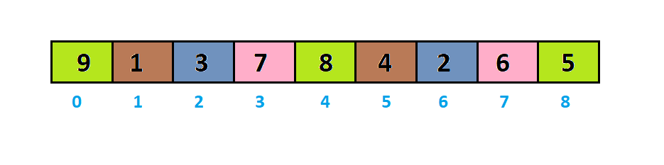
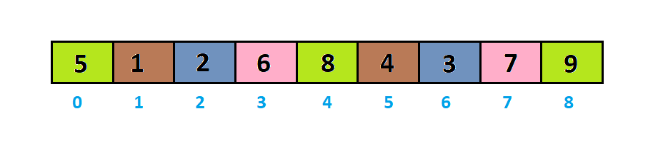
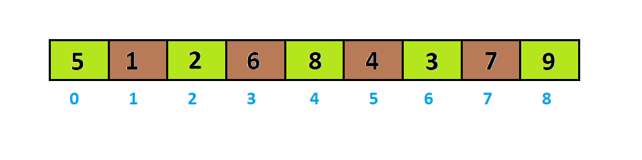
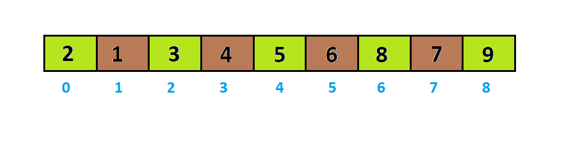
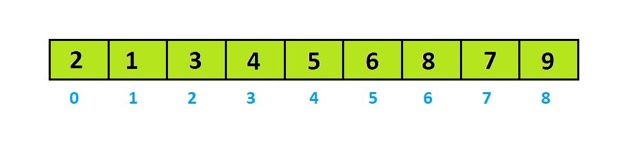
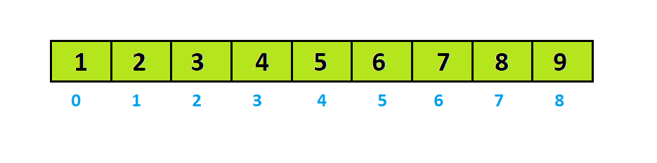

___**Contact :**___
- ___Github___:<https://github.com/Youknow2509>
- ___Gmail___: <lytranvinh.work@gmail.com>

# Shell Sort 

- **Shell Sort** là một giải thuật sắp xếp mang lại hiệu quả cao dựa trên giải thuật sắp xếp chèn **(Insertion Sort)**. Giải thuật này tránh các trường hợp phải tráo đổi vị trí của hai phần tử xa nhau trong giải thuật sắp xếp chọn (nếu như phần tử nhỏ hơn ở vị trí bên phải khá xa so với phần tử lớn hơn bên trái).

- *Đầu tiên*, giải thuật này sử dụng giải thuật sắp xếp chọn trên các phần tử có khoảng cách xa nhau, sau đó sắp xếp các phần tử có khoảng cách hẹp hơn. Khoảng cách này còn được gọi là khoảng (**interval**).

- **Interval** sẽ nhận giá trị lần lượt là **n/2**, **n/4**, **n/8** cho đến khi **interval = 1**.

- Giải thuật này khá hiệu quả với các tập dữ liệu có kích cỡ trung bình khi mà độ phức tạp trường hợp xấu nhất và trường hợp trung bình là O(n), với n là số phần tử.

- Cách **Shell Sort** hoạt động: 
    - Ví dụ sắp xết dãy `a = [9, 1, 3, 7, 8, 4, 2, 6, 5]` thành dãy không giảm.
  
    

    - Với `interval = 9/2 = 4`, ta sẽ chia dãy thành các dãy con với các số cách nhau một khoảng là interval: `[9, 8, 5]`, `[1, 4]`, `[3, 2]`và `[7, 6]`.

    - Sắp xếp những dãy con này theo cách sắp xếp chèn **(Insertion Sort)**.
    
    

    - -> Sau khi sắp xếp các dãy con dãy sẽ thành.

    

    - Với interval = 9/4 = 2, ta sẽ chia dãy thành các dãy con với các số cách nhau một khoảng là interval: [5, 2, 8, 3, 9], [1, 6, 4, 7]
  
    

    - -> Sau khi sắp xếp các dãy con dãy sẽ thành.

    

    - Với `interval = 9/8 = 1`, lúc này `interval = 1` ta áp dụng sắp xếp chèn với cả dãy a:

    

    - Dãy sau khi sắp xếp là:

    

