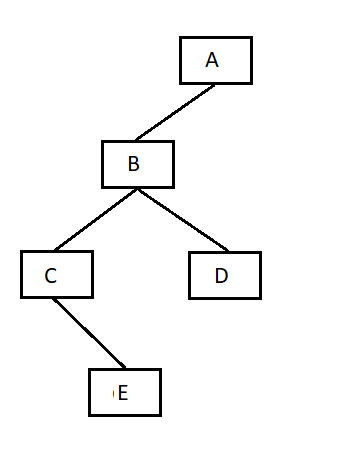
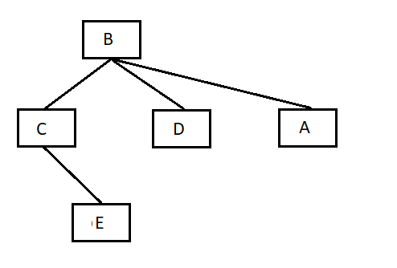
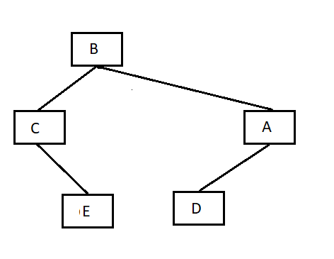
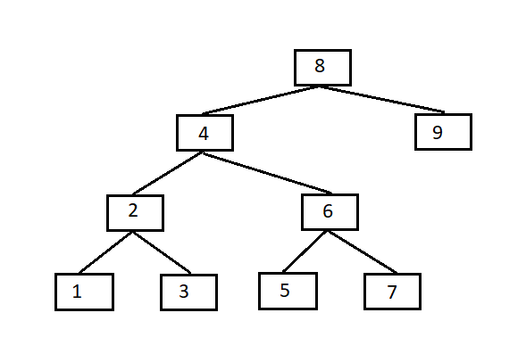
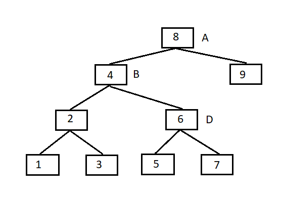
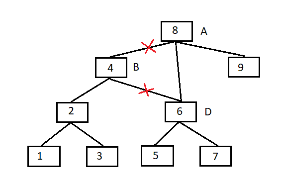
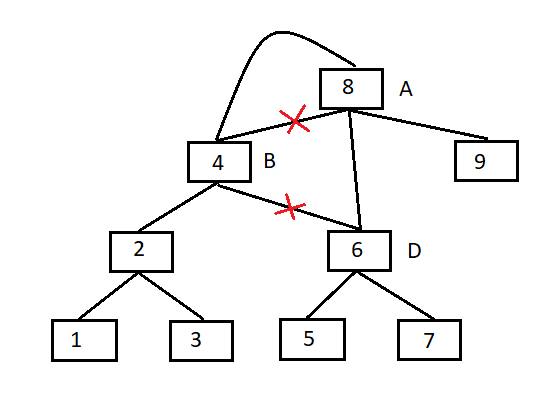
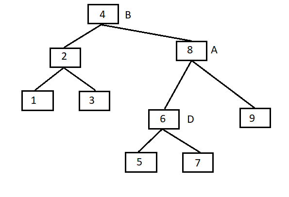
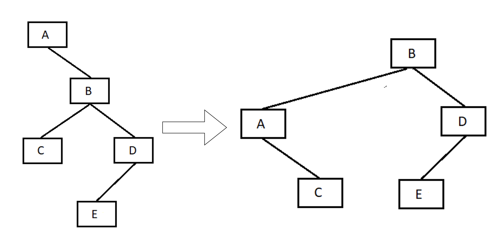

# Kỹ thuật xoay phải.

- Kỹ thuật này thường áp dụng cho những cây nhị phần tìm kiếm bị **lệch về bên trái** (độ cao của cây con trái lớn hơn độ của của cây con phải).
  
    

- Với cách xoay này ta cần quan tâm tới node gốc (A) cây con bên trái (B) và cây con bên phải của cây con bên trái (D).

- Cách xoay:

    - Biến đổi node B thành node gốc, node gốc (A) thành cây con bên phải của B.

        

    - Nếu như trên hình thi node B có tới 3 cây con, sai quy tắc của cây nhị phân, nên ta cần chuyển node D thành node con trái của A.
    *(lưu ý là 2 hoạt động trên diễn ra cùng lúc nên cần phải thêm một số node tạm).*

        

- Ví dụ cụ thể:

    

    Xoay cách xoay phải node trên:

    Gán code node tạm A, B, D vào các vị trí sau:

    

    Đầu tiên gán cây con bên trái của A thành D.

    

    Gán cây con bên phải của B thành A:

    

    Cây sau khi xoay là:

    

- Code mẫu C++:
  ```c++
  node *turnRight(node *a){
  	node *b = a->left;
  	node *d = b->right;
  	a->left = d;
  	b->right = a;
  	return b;
  }
  ```

# Kỹ thuật xoay trái.

- Tương tự kĩ thuật xoay phải

    

- Code mẫu C++:
  ```c++
  node *turnLeft(node *a){
  	node *b = a->right;
  	node *c = b->left;
  	a->right = c;
  	b->left = a;
  	return b;
  }
  ```

# Cách trường hợp xử lý cần bằng để thành cây AVL:

- Có `4` trường hợp lệch trong cây nhị phân tìm kiếm:`
    - Lệch trái - trái:
    - Lệch trái - phải:
    - Lệch phải - phải:
    - Lệch phải  - trái:

## Xử lý lệch trái - trái -> Xoay phải

```markdown
T1, T2, T3 and T4 are subtrees.
         z                                      y 
        / \                                   /   \
       y   T4      Xoay phải (z)             x      z
      / \          - - - - - - - - ->      /  \    /  \ 
     x   T3                               T1  T2  T3  T4
    / \
  T1   T2

```

## Xử lý lệch trái - phải:

```markdown
Với trường hợp lệnh trái - phải, ta phải thực hiện 2 phép xoay:
    Xoay trái trái ở cây con bên trái.
    Xoay phải cây.
```

```markdown
     z                               z                           x
    / \                            /   \                        /  \ 
   y   T4  Xoay trái (y)          x    T4  Xoay phải (z)      y      z
  / \      - - - - - - - - ->    /  \      - - - - - - - ->  / \    / \
T1   x                          y    T3                    T1  T2 T3  T4
    / \                        / \
  T2   T3                    T1   T2
```

## Xử lý lệch phải phải -> Xoay phải

```markdown

  z                                y
 /  \                            /   \ 
T1   y     Xoay trái (z)        z      x
    /  \   - - - - - - - ->    / \    / \
   T2   x                     T1  T2 T3  T4
       / \
     T3  T4

```

## Xử lý lệch phải trái:

```markdown
   z                            z                            x
  / \                          / \                          /  \ 
T1   y   Xoay phải (y)       T1   x      Xoay trái (z)    z      y
    / \  - - - - - - - - ->     /  \   - - - - - - - ->  / \    / \
   x   T4                      T2   y                  T1  T2  T3  T4
  / \                              /  \
T2   T3                           T3   T4
```

