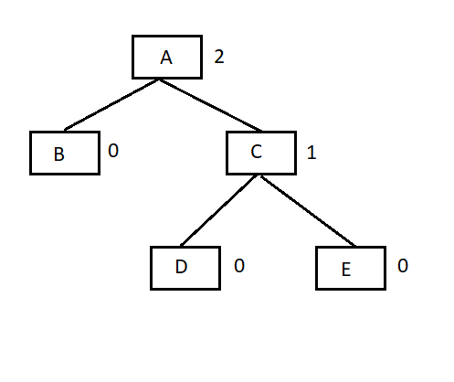

# Tree AVL

- Hiệu suất trường hợp xấu nhất của cây tìm kiếm nhị phân (**BST**) gần với các giải thuật tìm kiếm tuyến tính, tức là **Ο(n)**. Với dữ liệu thời gian thực, chúng ta không thể dự đoán mẫu dữ liệu và các tần số của nó. Vì thế, điều cần thiết phát sinh ở đây là để cân bằng cây tìm kiếm nhị phân đang tồn tại.

- **Cây AVL** (viết tắt của tên các nhà phát minh **A**delson, **V**elski và **L**andis) là cây tìm kiếm nhị phân có độ cân bằng cao. Cây AVL kiểm tra độ cao (bậc) của các cây con bên trái và cây con bên phải và bảo đảm rằng hiệu số giữa chúng là không lớn hơn `1`. **Hiệu số** này được gọi là **Balance Factor (Nhân tố cân bằng).**

- Hình ảnh ví dụ của cây AVL:

    