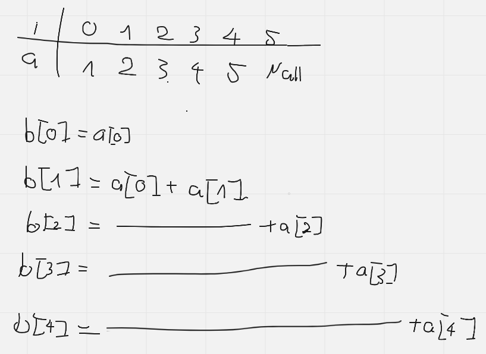

___**Contact :**___
- ___Github___:<https://github.com/Youknow2509>
- ___Gmail___: <lytranvinh.work@gmail.com>

# TÌM DÃY CON CÓ TỔNG THỎA MÃN
## Vấn đề: 
Cho trước số nguyên **n**, lập một mảng gồm **n** số nguyên, nhập một số nguyên **s**.
Hãy đưa ra dãy con liên tiếp đầu tiên của dãy **a** sao cho tổng của dãy đó bằng **s**. In dãy đó ra màn hình, sau mỗi phần tử có một khoảng trắng. Nếu không tồn tại dãy đó thì in ra **"-1"**.
## Cách thức hoạt động:
Tạo dãy **b**, với **b[0] = a[0], b[i] = b[i-1] + a[i]**.

Ví dụ với **a = [1, 2, 3, 4, 5]** và **s = 5**. Dãy b được tạo ra là **[1, 3, 6, 10, 15]**.

Mục đích chúng ta cần làm là cần tìm vị trí l và i sao cho **b[i] - b[l] = s**.
Như vậy dãy cần tìm sẽ là các phần tử từ ví trí l+1 đến i ở trong dãy a.

Dùng biến i duyệt dãy b, nếu **b[i] ≥ s** (dãy đó có thể kết thúc tại i) tìm vị trí của b[i]-s trong dãy b, nếu tồn tại vị trí l đó thì đưa ra dãy từ l+1 đến i.

